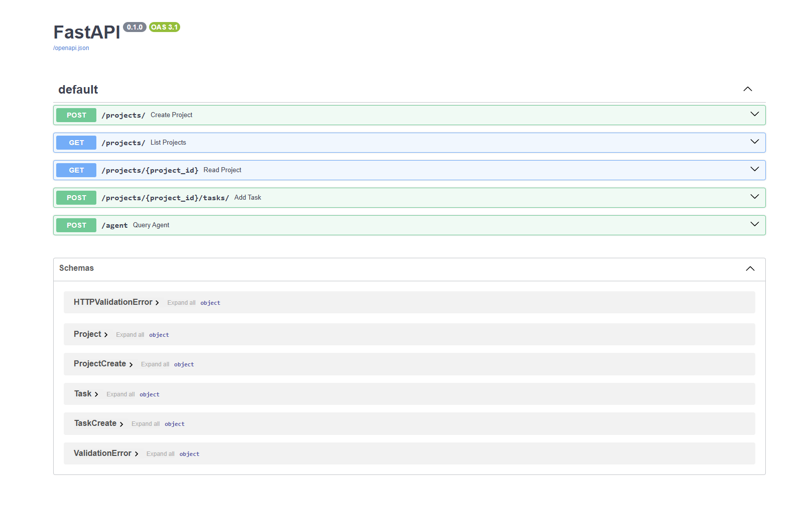
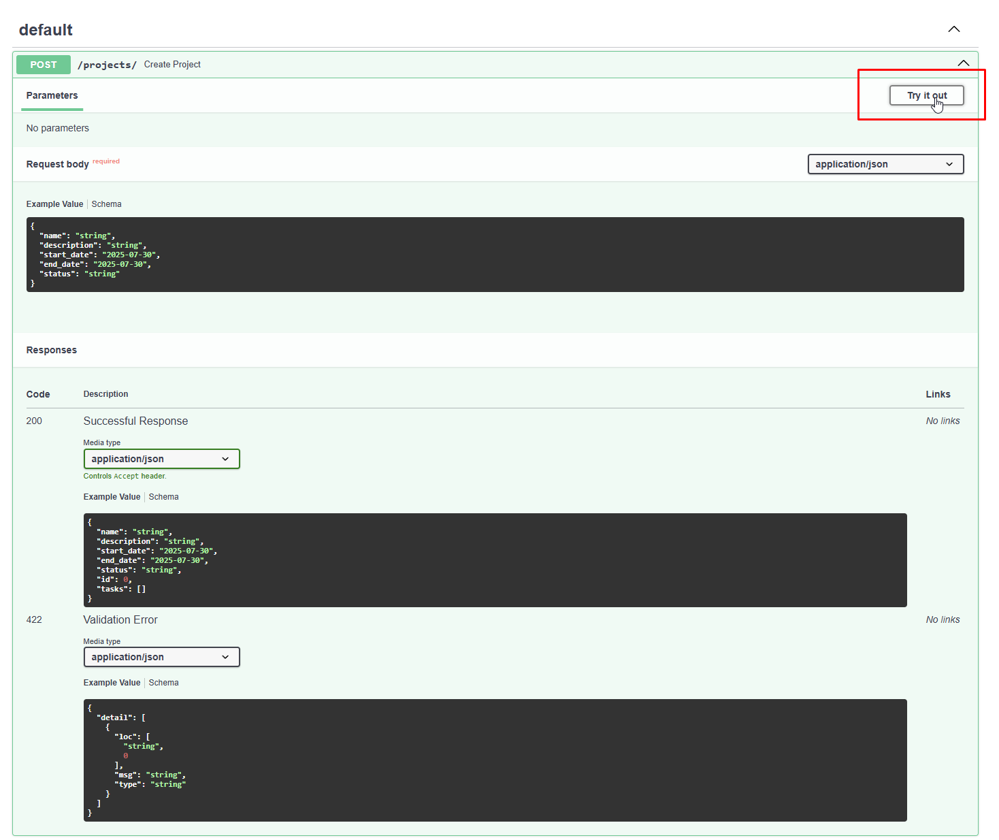
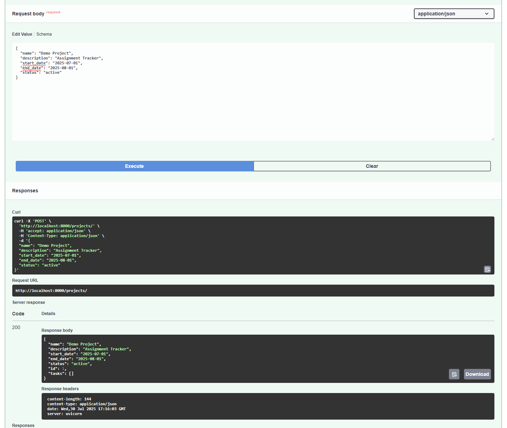
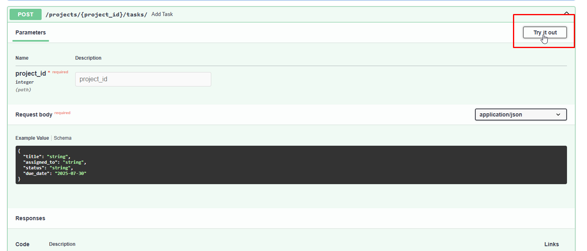
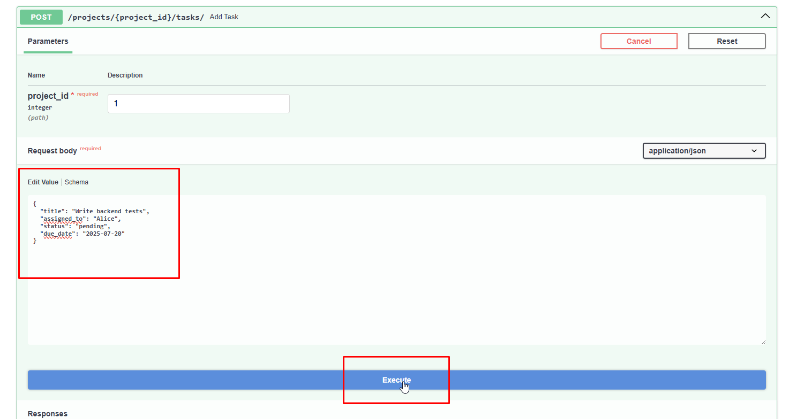
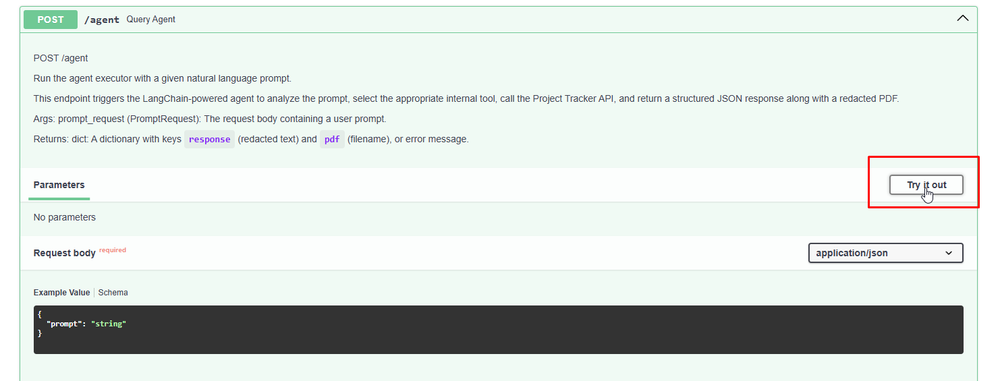
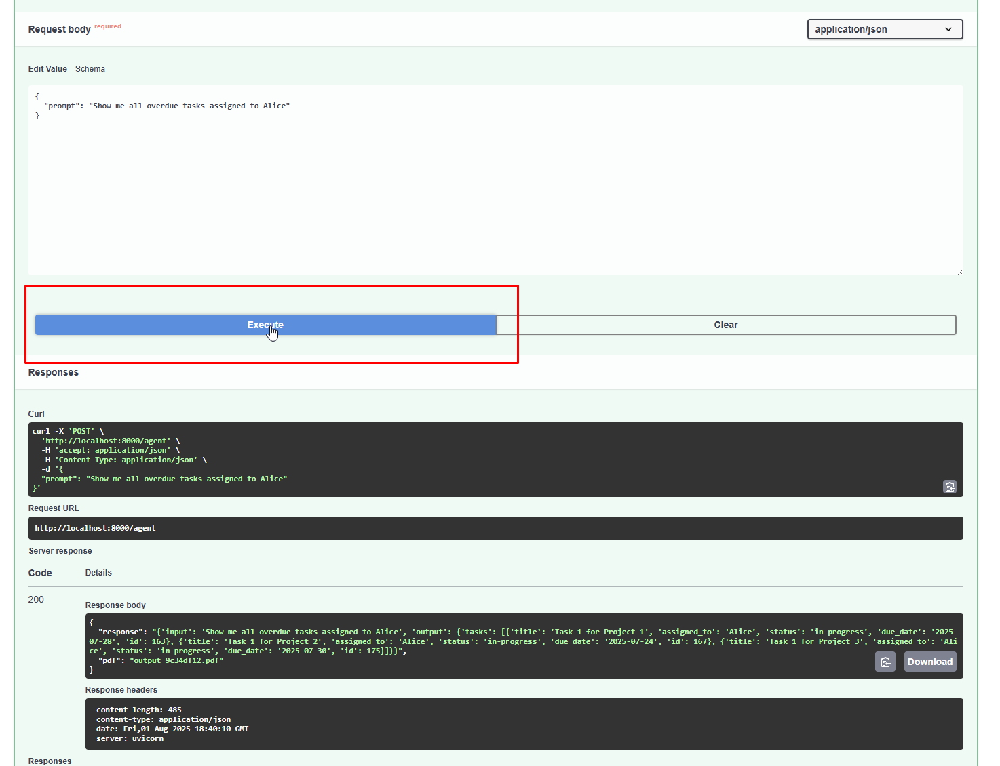

===========================
Part 1: Project Tracker API
===========================

I implements a RESTful project and task management API using **FastAPI** and
**PostgreSQL**, with full support for schema validation, querying, and
documentation.

Core Features
-------------

1. **Create Project**
   - Endpoint: `POST /projects/`
   - Fields: `name`, `description`, `start_date`, `end_date`, `status`

2. **Add Task to Project**
   - Endpoint: `POST /projects/{project_id}/tasks/`
   - Fields: `title`, `assigned_to`, `status`, `due_date`, `project_id`

3. **Retrieve Project and Tasks**
   - Endpoint: `GET /projects/{project_id}`
   - Returns: Project metadata + list of tasks

4. **Query Projects by Fields**
   - Endpoint: `GET /projects/`
   - Supports query params: `name`, `description`, `start_date`, `end_date`, `status`

Technical Highlights
--------------------

- Uses **SQLAlchemy ORM** and **Pydantic** for model and schema validation
- **Dockerized** with PostgreSQL and Redis for local development
- **Swagger/OpenAPI docs** at `/docs`
- Supports **filter chaining** via query parameters

Bonus Features
--------------

- **Caching layer** (Redis) for frequently used agent prompts
- **Seed endpoint** (`POST /seed`) for injecting sample data
- **Unit test** suite using `pytest` in `tests/test_api.py`
- Clean separation of concerns via `project.py`, `schema.py`, `model.py`

Usage
-----

Run locally with Docker:

.. code-block:: bash

    docker-compose up --build

Access API documentation:

.. code-block:: none

    http://localhost:8000/docs

Seed demo data:

.. code-block:: bash

    curl -X POST http://localhost:8000/seed

==========================================================
Part 2: Agentic Workflow with Model Context Protocol (MCP)
==========================================================

Goal
----

Enable natural language interaction between a user and the backend
project-tracking system using an MCP-compatible agent that:

1. interprets context
2. routes the request to the appropriate API
3. returns structured results.

Implementation Summary
----------------------

I built a LangChain-based MCP tool that supports:

* Multiple tools (via `Tool` objects).
* Internal API calls to the `FastAPI` service.
* Secure, redacted responses.
* Redis based caching.
* PDF generation.
* Telemetry logging.

The following agent tools are implemented:

| Tool Name           | Description                               |
| ------------------- | ----------------------------------------- |
| `FetchOverdueTasks` | Gets overdue tasks for a given assignee.  |
| `FetchAllTasks`     | Gets all tasks assigned to a user.        |
| `ListProjects`      | Lists all active projects.                |
| `GetProjectById`    | Returns full project & task details by ID.|
| `FallbackTool`      | Handles unsupported/unrecognized prompts. |

Prompt Engineering Technique
----------------------------

I used LangChain’s ZERO_SHOT_REACT_DESCRIPTION agent type.

To route natural language prompts correctly, I crafted detailed descriptions for
each tool. Example:

.. code-block:: python

    Tool(
      name="FetchOverdueTasks",
      func=fetch_overdue_tasks,
      description="Fetch only overdue tasks assigned to a specific user"
    )

This allows the agent to match user intent with tool capability based on
semantic interpretation.

Prompt Preprocessing Layers:

* Lowercase normalization
* Caching via Redis
* Prompt telemetry with timestamp for audits

Full Flow Simulation
--------------------

Let us take the following prompt as an example:

**"Show me all overdue tasks assigned to Alice"**

.. code-block:: plaintext

Prompt -> LangChain Agent ->
  Selects Tool: FetchOverdueTasks ->
  Calls API: GET /projects?status=active ->
  Extracts: tasks assigned to Alice and due_date < today ->
  Redacts PII ->
  Logs telemetry ->
  Renders PDF ->
  Returns JSON & PDF link

Agent Response:
~~~~~~~~~~~~~~~
.. code-block:: json

    {
      "response": "{'tasks': [{'title': 'Write backend tests', 'assigned_to': 'Alice', 'status': 'pending', 'due_date': '2025-07-29', 'id': 27}, {'title': 'Email vendor john', 'assigned_to': 'Alice', 'status': 'pending', 'due_date': '2025-07-30', 'id': 29}]}",
      "pdf": "output_c588873b.pdf"
    }

Guardrails & Safety
-------------------

I implemented three core protection layers:

| Guardrail          | Description                                         |
| ------------------ | --------------------------------------------------- |
| **PII Redaction**  | Regex-based masking of emails, SSNs, phone numbers  |
| **Prompt Logging** | All inputs/outputs logged to Redis for review       |
| **Fallback Tool**  | Prevents hallucinated tool usage or invalid queries |

Feature Summary
---------------

| Feature                         | Implemented |
| ------------------------------- | ----------- |
| Accepts prompts                 | Y           |
| Agentic tool selection          | Y           |
| Calls internal APIs             | Y           |
| Returns structured results      | Y           |
| Prompt design and routing       | Y           |
| Redaction and fallback handling | Y           |
| Safety guardrails (PII/logging) | Y           |

==================
Setup Instructions
==================

1. Ensure `Docker <https://www.docker.com/>`_ is installed.
1. Checkout the repo:

    .. code-block:: sh
        git clone https://github.com/hellosauravgupta/project-tracker-agent.git
        cd project-tracker-agent

1. Build the container:

    .. code-block:: sh
        docker-compose up --build

====================
Testing Instructions
====================

Test endpoints
--------------

Go to: `API page <http://localhost:8000/docs>`_

Create a Project
~~~~~~~~~~~~~~~~

`POST /projects`

Enter data. For example:

.. code-block:: json

    {
      "name": "Demo Project",
      "description": "Assignment Tracker",
      "start_date": "2025-07-01",
      "end_date": "2025-08-01",
      "status": "active"
    }

Check result:

Add Tasks
~~~~~~~~~

`POST /projects/1/tasks/`

Enter data. For example:

.. code-block:: json

    {
      "title": "Write backend tests",
      "assigned_to": "Alice",
      "status": "pending",
      "due_date": "2025-07-20"
    }

Check result:

Test Agent Prompt Endpoint
~~~~~~~~~~~~~~~~~~~~~~~~~~

.. note:: You may use the `seed` endpoint to add test data to the database, if you wish.

`POST /agent`

Enter data. For example:

.. code-block:: text

    "Show me all overdue tasks assigned to Alice"

Check result:

You may observe in the log:

.. code-block::

    web-1    | > Entering new AgentExecutor chain...
    web-1    |  I need to fetch all overdue tasks assigned to Alice
    web-1    | Action: FetchOverdueTasks
    web-1    | Action Input: Alice
    web-1    | Observation: {'tasks': [{'title': 'Write backend tests', 'assigned_to': 'Alice', 'status': 'pending', 'due_date': '2025-07-20', 'id': 1}]}
    web-1    |
    web-1    |
    web-1    | > Finished chain.

You may also open the output pdf to verify results:

.. code-block:: sh

    docker cp <container>:/app/output_<id>.pdf <local path>

======================
Supported Prompt Types
======================

Assigned Tasks
~~~~~~~~~~~~~~

**Tool**: `FetchAllTasks`

Example prompts:

* "Show me all tasks assigned to Alice"
* "List everything Carol is working on"
* "Get tasks assigned to Bob"

Example log output: "List everything Carol is working on"

.. code-block:: none

    web-1    | > Entering new AgentExecutor chain...
    web-1    |  I need to use the FetchAllTasks action to get all tasks assigned to Carol
    web-1    | Action: FetchAllTasks
    web-1    | Action Input: CarolINFO:     127.0.0.1:46068 - "GET /projects/?status=active HTTP/1.1" 200 OK
    web-1    |
    web-1    | Observation: {'tasks': [{'title': 'Create CI pipeline', 'assigned_to': 'Carol', 'status': 'in-progress', 'due_date': '2025-08-03', 'id': 30}]}
    web-1    |
    web-1    |
    web-1    | > Finished chain.

Overdue Tasks
~~~~~~~~~~~~~

**Tool**: `FetchOverdueTasks`

Example prompts:

* "What overdue tasks does Alice have?"
* "List pending tasks past their deadline for Carol"
* "Fetch overdue tasks for Bob"

Example log output: "What overdue tasks does Alice have?"

.. code-block:: none

    web-1    | > Entering new AgentExecutor chain...
    web-1    |  I need to fetch overdue tasks assigned to Alice.
    web-1    | Action: FetchOverdueTasks
    web-1    | Action Input: AliceINFO:     127.0.0.1:58128 - "GET /projects/?status=active HTTP/1.1" 200 OK
    web-1    |
    web-1    | Observation: {'tasks': [{'title': 'Write backend tests', 'assigned_to': 'Alice', 'status': 'pending', 'due_date': '2025-07-29', 'id': 27}, {'title': 'Email vendor john', 'assigned_to': 'Alice', 'status': 'pending', 'due_date': '2025-07-30', 'id': 29}]}
    web-1    |
    web-1    |
    web-1    | > Finished chain.

List Projects
~~~~~~~~~~~~~

**Tool**: `ListProjects`

Example prompts:

* "Show me all current projects"
* "List all projects"
* "What projects are in progress?"

Project By ID
~~~~~~~~~~~~~

**Tool**: `GetProjectById`

Example prompts:

* "Get the project with ID 1"
* "Show project 2 and its tasks"
* "Fetch project 3"

Example log output:

.. code-block:: none

    web-1    | INFO:     172.18.0.1:57144 - "POST /agent?prompt=Get%20the%20project%20with%20ID%206 HTTP/1.1" 200 OK
    web-1    | INFO:     172.18.0.1:60282 - "GET /projects/ HTTP/1.1" 200 OK
    web-1    |
    web-1    |
    web-1    | > Entering new AgentExecutor chain...
    web-1    |  I should use the GetProjectById tool to get the project with ID 8
    web-1    | Action: GetProjectById
    web-1    | Action Input: 8INFO:     127.0.0.1:37122 - "GET /projects/8 HTTP/1.1" 200 OK
    web-1    |
    web-1    | Observation: {'name': 'Demo Project', 'description': 'A seeded project with multiple tasks', 'start_date': '2025-07-16', 'end_date': '2025-08-15', 'status': 'active', 'id': 8, 'tasks': [{'title': 'Write backend tests', 'assigned_to': 'Alice', 'status': 'pending', 'due_date': '2025-07-29', 'id': 27}, {'title': 'Design schema', 'assigned_to': 'Bob', 'status': 'done', 'due_date': '2025-07-26', 'id': 28}, {'title': 'Email vendor john', 'assigned_to': 'Alice', 'status': 'pending', 'due_date': '2025-07-30', 'id': 29}, {'title': 'Create CI pipeline', 'assigned_to': 'Carol', 'status': 'in-progress', 'due_date': '2025-08-03', 'id': 30}]}
    web-1    |
    web-1    |
    web-1    | > Finished chain.

Filtering + Retrieval
~~~~~~~~~~~~~~~~~~~~~

"List all tasks assigned to Alice that are overdue"

Chooses `FetchOverdueTasks` and returns redacted `JSON + PDF`

User-Specific Workflows
~~~~~~~~~~~~~~~~~~~~~~~

"Show everything Carol is doing this week"

Example log output:

.. code-block:: none

    web-1    | > Entering new AgentExecutor chain...
    web-1    |  I need to fetch all tasks assigned to Carol and filter them by this week's date.
    web-1    | Action: FetchAllTasks
    web-1    | Action Input: Carol
    web-1    | Observation: {'tasks': [{'title': 'Create CI pipeline', 'assigned_to': 'Carol', 'status': 'in-progress', 'due_date': '2025-08-03', 'id': 30}]}
    web-1    |
    web-1    |
    web-1    | > Finished chain.

================
MCP Tool Summary
================

| Tool                | Triggers                                         |
| ------------------- | ------------------------------------------------ |
| `FetchAllTasks`     | "assigned to", "working on", name only           |
| `FetchOverdueTasks` | "overdue", "past due", "missed", "late"          |
| `ListProjects`      | "list projects", "all projects", "show projects" |
| `GetProjectById`    | "project X", "project ID", "fetch project 2"     |

=================================
MCP Agent Tools Prompt Test Sheet
=================================

|  # | Prompt                                    | Expected Tool       | Description                          |
| -: | ----------------------------------------- | ------------------- | ------------------------------------ |
|  1 | Show me all tasks assigned to Alice       | `FetchAllTasks`     | Generic retrieval, no time condition |
|  2 | List overdue tasks for Carol              | `FetchOverdueTasks` | Triggered by "overdue"               |
|  3 | What’s pending for Bob past the deadline? | `FetchOverdueTasks` | "past the deadline" -> overdue        |
|  4 | Get all tasks for Bob                     | `FetchAllTasks`     | No temporal qualifier                |
|  5 | List all projects                         | `ListProjects`      | Top-level project list               |
|  6 | Show me project 1                         | `GetProjectById`    | ID mentioned explicitly              |
|  7 | What is in project 2?                     | `GetProjectById`    | Context query for ID 2               |
|  8 | Show everything Carol is working on       | `FetchAllTasks`     | Verb "working on" implies assignment |

=====================
Future Considerations
=====================

While not currently scoped, the following enhancements are possible:

**Prompt**: "How many tasks are pending for each user?"
**Explanation**: This requires aggregation logic on the results from the `project.list_all_projects` functionality.

**Prompt**: "Create a new task for Bob"
**Explanation**: This can trigger a write action via `project.add_task_to_project` functionality.

**Prompt**: "Compare projects by end date"
**Explanation**: This requires reasoning & sorting logic on the results from the `project.get_projects` functionality.
